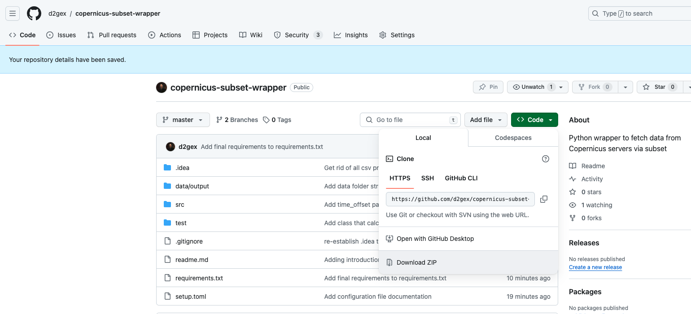
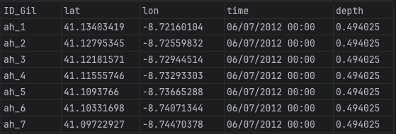

 # Table of content:
 - [Introduction](#introduction)
 - [Installation](#installation)
 - [Quickstart](#quickstart)
 - [Configuration](#configuration)
 - [Execution](#execution)

<a id="introduction"></a>
# 1. Introduction
This is a wrapper to help you download data from [Copernicus servers](https://marine.copernicus.eu/register-copernicus-marine-service?mtm_campaign=Copernicus-Souscription&mtm_medium=cpc&mtm_source=google&mtm_content=text&mtm_cid=145762311002&mtm_kwd=copernicus%20marine%20data&gad_source=1&gclid=CjwKCAiAnL-sBhBnEiwAJRGigvyODuGJ__Aa1pjKNB8H7VvH_lrn3Fu-CJdZO1T_g-ChP95GC8fxFRoCLZsQAvD_BwE) via a configuration file, eliminating therefore the
need to deal with programming. It has been developed in Python 3.9 and makes calls to the recently released [Copernicus Marine Toolbox's python API](https://help.marine.copernicus.eu/en/collections/5821001-python-library-api) - as per December 2023.

The main advantages over the [toolbox's console client](https://help.marine.copernicus.eu/en/collections/5820990-command-line-interface-cli) are as follows:

1. The inputted data is processed by rows, fetching each row individually to avoid having to deal with massive files.
2. The downloaded data is all amalgamated together and converted to csv.
3. Although the data fetched is by area, the script will find the point in the downloaded area nearest to the that requested, meaning that
   the final downloaded file has got the same number of rows as the inputted file.
4. Original individual fetched files are kept intact - **.nc format** - so that they can be post-processed in whichever way you consider appropriate, should you need to do so in the forthcoming future.

This wrapper uses solely the `subset` functionality of the Copernicus Marine Toolbox's Python API.

<a id="installation"></a>
# 2. Installation

Firstly you need to install **Python >=3.9 and < 3.12** as required by Copernicus Marine Toolbox and **pip**.  To do 
so download the Python version of your choice from https://www.python.org/downloads/ and then follow the instructions 
on https://docs.python.org/3/using/index.html. Details for Windows, Mac and *nix users are provided in the appropriate sections.

Secondly you need to download the source code from Github either by downloading  the zip directly from the web on https://github.com/d2gex/copernicus-subset-wrapper.git as
shown in the figure below ...



... Or just git-cloning to your preferred location, ensuring that the destination folder is empty:

```bash
   cd <<your_source_folder>>
   git clone https://github.com/d2gex/copernicus-subset-wrapper.git .
```

Thirdly you need to install the project dependencies. If you do not want to install them system-wide, which is highly 
recommended not do so, you can create a virtual environment as described on [Python Virtual Environments and Packages](https://docs.python.org/3/tutorial/venv.html).
A quick tutorial for the virtual environment creation is shown below:

```bash
   python3 -m venv <<your_virtualenv_folder>>
   source /path/to/your_virtualenv_folder/bin/activate
```

Lastly, all that is left now is to install all requirements at once as follows:

```bash
   pip install -r /path/to/your_source_folder/requirements.txt
```
The file **requirements.txt** contain all libraries that are necessary for this wrapper to run.


<a id="quickstart"></a>
# 3. Quickstart
In a hurry? Follows the three quick steps below:

## 3.1 Ensure the inputs are in the correct format



In a nutshell, columns `lat`, `long`, `time` and `depth` must be named as such and `time` must be in `%d/%m/%Y %H:%M`. 
The coordinate system is **WGS 84 EPSG: 4326**. There must be a column in the spreadsheet identifying each row uniquely,

## 3.2 Configure your *setup.toml* file

```yaml
input_filename = "api_parameters.csv" # name of the file holding the input parameters
output_filename = "result.nc" # suffix added to the name of each individual file fetched per input row
dataset_id = "cmems_mod_glo_phy_my_0.083deg_P1M-m" # data set identifier
variables = ["thetao", "zos"] # variables wanting to be fetched
years = [2012, 2020] #  date interval of interest
# distance method used to calculate the nearest point.
# See alternatives on https://docs.scipy.org/doc/scipy/reference/generated/scipy.spatial.distance.cdist.html
distance = "euclidean"
# [days, hours, minutes, seconds] time added to each start_time - per row - in days, hours, minutes and seconds
time_offset = [0, 23, 59, 59]
start_mode = 0  # 0 start afresh, 1 resume from given years interval and 2 read only from disk
```

## 3.3 Run the wrapper

```bash
   cd your_source_folder
   python -m src.main
```

After the data has been downloaded look for the resulting file in  `your_source_folder/data/<<dataset identifier>>/csv/<<dataset identifier>>.csv`

All done!
<a id="configuration"></a>
# 4. Configuration

<a id="execution"></a>
# 5. Execution

